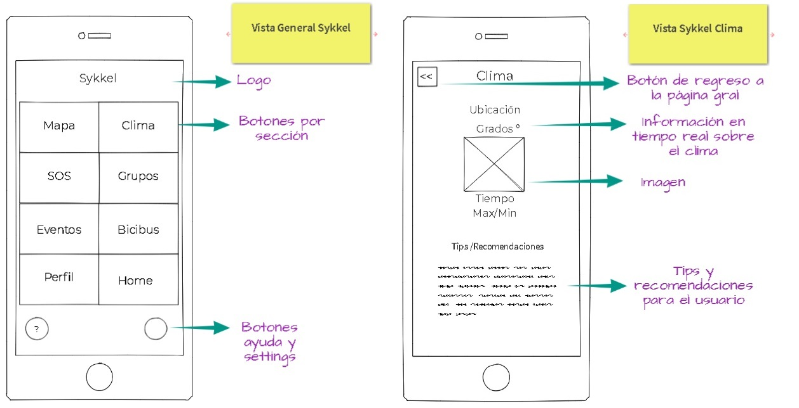
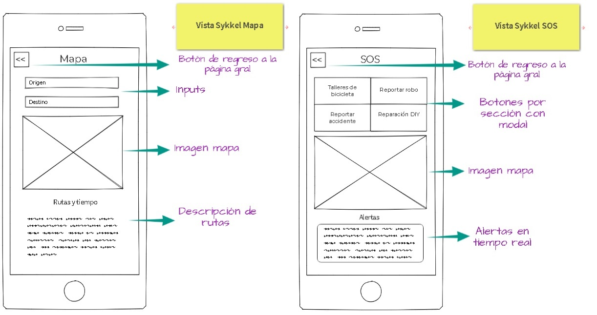
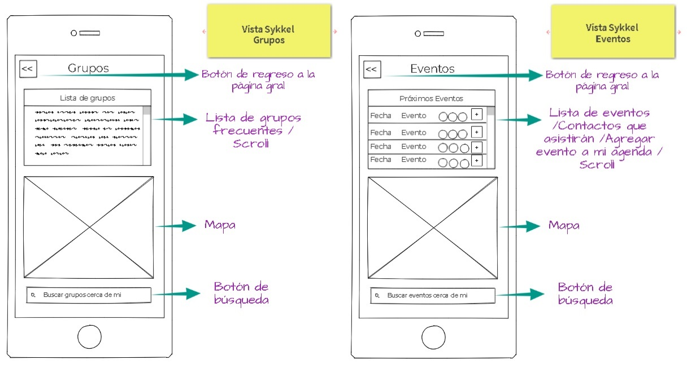
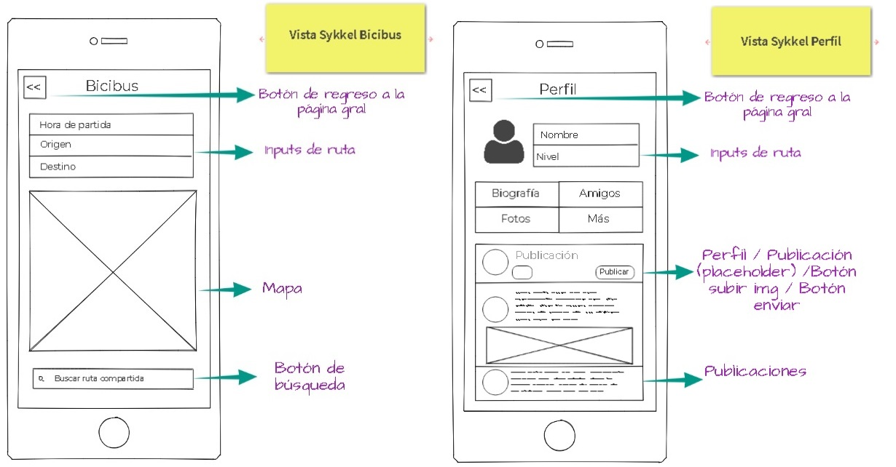

# Sykkel - Ride in community

## User Research

Grupo de 5 a 10 personas: personas que utilizan la bicicleta como medio de transporte diario o como una actividad recreativa.

## Supuestos

Las aplicaciones para ciclistas están enfocadas en medir su rendimiento y distancia como deportistas.
Los ciclistas necesitan una red social para comunicarse y organizarse como comunidad.

## Pain Points

- Tener conocimiento del clima actualizado para poder tomar precauciones antes de salir en bici.

- Un mapa que les ofrezca :
 - La ruta más rápida para llegar a su destino.
 - Los talleres para bicicletas mas cercanos a su ubicación, con horarios de atención y rating.
 - Descargar el mapa offline en el caso que al salir, no tengan acceso a internet.
- Conocer grupos ciclistas donde tengan acceso a:
 - Calendario y agenda de actividades por grupo  ciclista.
 - Mapa con la ubicación de los grupos ciclistas cerca de tu ubicación.
 - Los horarios, costos y el nivel de dificultad de la actividad del grupo ciclista: básico - intermedio - avanzado.
 - Bicibus: la posibilidad de compartir la ruta con otro ciclista. En el caso de las mujeres ciclistas el compartir su ruta con otra ciclista les ofrece mayor seguridad.

- Una sección Auxilio SOS, donde los usuarios podrán reportar bicicletas robadas, accidentes o algún imprevisto que necesite de ayuda técnica en tiempo real.

## Objetivo

Crear una red social para ciclistas que ayude a los usuarios a conocer los distintos grupos y actividades que existen para ellos en la ciudad.

## Perfil

El usuario al registrarse en la aplicación escoge cuales son sus intereses, debido a que existen distintos grupos ciclistas que tienen actividades relacionadas con:
- Arte
- Social
- Comida
- Aventura

El usuario deberá contestar una serie de preguntas que nos ofrecerán conocimientos específicos sobre su perfil:
- ¿Para qué utilizas tu bici?
 - Para transportarte a tu trabajo
 - Como actividad recreativa
- ¿Con qué frecuencia sales en bici?
 - Diario
 - De 3 a 5 veces por semana
 - De 3 a 5 veces por mes
- ¿Cuál consideras que es tu nivel de experiencia como ciclista?
 - Básico
 - Intermedio
 - Avanzado
- ¿Perteneces a algún grupo ciclista?
 - Si
 - No
- ¿Te gustaria pertenecer a alguno?
 - Si
 - No.

## Retos

- Que los usuarios conozcan la red social y la compartan con otros usuarios ciclistas.
- Invitar a otras personas a realizar más actividades en bici y unirse a la comunidad.
- Que los usuarios quieran pagar un servicio plus que les otorgue beneficios extra por ser parte de la comunidad.

## Cronograma de actividades

## Sketching

### Versión Mobil

### Versión Desktop

### WareFrame
